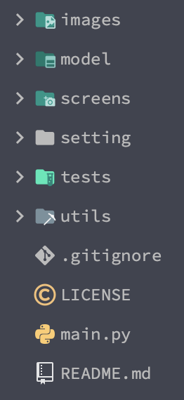

# 나루토 인술로 파일 암호화, 복호화 해버리기!

## 개발 동기

그냥 나루토를 좋아하는 평범한 방구석 닌자였었다.  
그러다 깃허브의 재밌는 레포지토리를 보게 되었는데...  
그것은 [카즈히토상의 나루토 Hand Sign Detection!](https://github.com/Kazuhito00/NARUTO-HandSignDetection/blob/main/README_EN.md)  
오픈소스를 보자마자 바로 작업에 들어가야겠다고 생각했다.  
그래서 이 모델로 무슨 짓을 해야 유용하면서도 재밌을까 생각해봤다.  
그래서 내린 결론이 패스워드의 인터페이스를 인술로 하면 재밌겠다고 판단했다.  
그 후 바로 소스를 까고 작업에 들어갔다.

## 개발에 사용한 것

- 카즈히토상의 인술 탐지 모델(onnx)
  - .onnx 파일을 핸들링하는 [클래스](https://github.com/Kazuhito00/NARUTO-HandSignDetection/blob/main/model/yolox/yolox_onnx.py)를 사용하였다.
- [Tkinter](https://docs.python.org/ko/3/library/tkinter.html)
  - 컴퓨터 응용프로그램을 목적으로 개발을 시작했다.  
    응용프로그램을 실제 상품의 목적이 아닌 내가 직접쓰는
    간단한 프로그램이 목적이였다.  
    그래서 파이썬의 내장 라이브러리인 Tkinter로 빠르게 개발을 할 수 있기에 선택하였다.
- 이미지 핸들링 라이브러리
  - [Pillow](https://pillow.readthedocs.io/)
    - Tkinter에 이미지, 캠을 삽입할때 사용했다.
  - [OpenCV](https://opencv-python.readthedocs.io/en/latest/)
    - 캠을 캡쳐한 사진을 가져올때, 모델의 input을 처리할때 사용했다.
- [PyCryptodome](https://pycryptodome.readthedocs.io/en/latest/src/installation.html)
  - 예전부터 사용되던 PyCrypto와 호환성을 각제 만든 것이 PyCryptodome이다.  
    파일을 암호화, 복호화할때 사용했다.

## 구현

화면구현을 담담하는 코드는 간단하게 계층구조와 메서드를 추상적으로 설명하겠다.  
모델 핸들링 코드와 파일 암호화, 복호화 부분은 조금 구체적으로 얘기해보도록 하겠다.  
오픈소스이므로 [내 깃허브 레포지토리](https://github.com/sonG1031/lockruto)를 통해 설명하지 못한 부분을 스스로 느껴보자.

### 프로젝트 구조

프로젝트 구조는 아래와 같다.
{: .text-center}
{: .align-center .img-width-half}

- images
  - 화면구현에 사용한 버튼, 배경화면 등을 담고있다.
- model
  - 카즈히토상의 오픈소스에서 그대로 가져온 폴더이다.  
    .onnx 파일과 그 파일을 inference할 수 있는 클래스 파일이 있다.
- screens
  - tkinter를 통한 화면을 구성하는 코드를 담고있다.
- settings
  - model에서 나온 결과와 비교하여 문자열 값을 얻기 위해 .csv 파일로 각 인술명이 적혀있다.
- tests
  - 그냥 개발과정에서 테스트할 코드를 적은 폴더이다.
- utils
  - 소리를 재생(버튼 클릭시, 암호화 시)시켜주는 기능을 담고있다.
- main.py
  - 프로그램을 실행했을때 시작점이다.

### 화면구현 부분

- screens/basic_screen.py

```python
from tkinter import *

class Screen:
    def __init__(self, root):

        self.colors = {
            "background": "#000000",
            "button": "#332F2E",
            "box": "#1F1C1C",
            "activeBtn": "#D941A4"
        }

        self.frames = {
            "start_screen": Frame(root, relief="solid", bg=self.colors["background"]),
            "files_screen": Frame(root, relief="solid", bg=self.colors["background"]),
            "lock_screen": Frame(root, relief="solid", bg=self.colors["background"]),
            "jutsu_screen": Frame(root, relief="solid", bg=self.colors["background"]),
            "open_screen": Frame(root, relief="solid", bg=self.colors["background"]),
            "unlock_screen": Frame(root, relief="solid", bg=self.colors["background"]),
        }

        self.root = root
        self.root.title("Lockruto")
        self.root.resizable(False, False)
        self.root.geometry("720x720")
        self.root.config(bg=self.colors['background'])

    def show_screen(self):
        from screens.frames import StartFrame

        st_screen = StartFrame(self.root, self.frames, "start_screen", self.colors)
        st_screen.create_frame()

        self.root.mainloop()
```

화면 코드 구조는 전역으로 관리되는 화면을 그린 다음,  
각 메뉴에 맞게 화면을 프레임으로 구성하여 화면을 나누었다.  
이 클래스의 인스턴스를 main.py에서 생성하여 show_screen() 메서드를 호출하면  
모든 화면들의 사이클이 시작된다.  
show_screen()에서는 시작 화면 프레임을 화면에 그린다.

- screens/basic_frames.py

```python
from tkinter import *
from tkinter import Listbox

from PIL import Image, ImageTk
from tkmacosx import Button

from utils import playSound
class ScreenFrame:
    def __init__(self, root, frames, frame_name, colors):
        self.root = root
        self.frame = frames
        self.frame_name = frame_name
        self.colors = colors
        self.list_file = None

    def create_frame(self):
        pass

    def pack_frame(self, frame_pady): # frame_pady: tuple(top: int, bottom: int)
        self.frame[self.frame_name].pack(pady=frame_pady)

    def create_title(self, title_path, title_size): # titleSize: tuple(int, int)
        title_img = Image.open(title_path)
        title_img = title_img.resize(title_size, Image.ANTIALIAS)
        title_photo = ImageTk.PhotoImage(title_img)
        title = Label(self.frame[self.frame_name], image=title_photo, bg=self.colors["background"], )
        title.image = title_photo
        title.pack(side="top")

    def create_list(self):
        list_frame = Frame(
            self.frame[self.frame_name],
            padx=100,
            pady=20,
            bg=self.colors["background"],
        )
        list_frame.pack(side="top", fill="both")

        scrollbar = Scrollbar(list_frame)
        scrollbar.pack(side="right", fill="y")

        self.list_file = Listbox(
            list_frame,
            selectmode="extended",
            height=15,
            width=200,
            bg=self.colors["box"],
            yscrollcommand=scrollbar.set)
        self.list_file.pack(side="left", fill="both", expand=True)
        scrollbar.config(command=self.list_file.yview)

        self.list_file.focus_set()

    def create_btns(self, btns_info):
        btns_frame = Frame(
            self.frame[self.frame_name],
            bg=self.colors["background"],
        )
        btns_frame.pack(pady=(0,20))

        for btn_info in btns_info:
            self.create_btn(btns_frame, **btn_info)


    def create_btn(
            self,
            btns_frame,
            btn_path,
            btn_size, # btn_size: tuple(int, int)
            btn_w,
            btn_h,
            btn_cmd,
            btn_side):
        btn_img = Image.open(btn_path)
        btn_img = btn_img.resize(btn_size, Image.ANTIALIAS)
        btn_photo = ImageTk.PhotoImage(btn_img)

        btn = Button(
            btns_frame,
            image=btn_photo,
            width=btn_w,
            height=btn_h,
            fg=self.colors["button"],
            activebackground=self.colors["activeBtn"],
            bg=self.colors["background"],
            borderless=1,
            command=btn_cmd
        )
        btn.image = btn_photo
        btn.pack(side=btn_side, padx=10)

    def create_bg(self, bg_path):
        bg_photo = PhotoImage(file=bg_path)
        bg = Label(self.frame[self.frame_name], image=bg_photo, bg=self.colors["background"],)
        bg.image = bg_photo
        bg.pack(side="bottom")


    def move_window(self, move_frame_name, lst_files=None):
        from screens.frames import StartFrame, FilesFrame, LockFrame, JutsuFrame, OpenFrame, UnlockFrame
        playSound("./utils/sounds/HEUA.mp3")

        self.frame[self.frame_name].destroy()
        self.frame[self.frame_name] = Frame(self.root, relief="solid", bg=self.colors["background"])
        print(f"{self.frame_name} destroyed")

        if move_frame_name == "start_screen":
            StartFrame(self.root, self.frame, "start_screen", self.colors).create_frame()
        elif move_frame_name == "files_screen":
            FilesFrame(self.root, self.frame, "files_screen", self.colors).create_frame()
        elif move_frame_name == "lock_screen":
            LockFrame(self.root, self.frame, "lock_screen", self.colors, lst_files).create_frame()
        elif move_frame_name == "jutsu_screen":
            JutsuFrame(self.root, self.frame, "jutsu_screen", self.colors, lst_files).create_frame()
        elif move_frame_name == "open_screen":
            OpenFrame(self.root, self.frame, "open_screen", self.colors, lst_files).create_frame()
        elif move_frame_name == "unlock_screen":
            UnlockFrame(self.root, self.frame, "unlock_screen", self.colors, lst_files).create_frame()
```

메뉴에 맞는 프레임을 만들때 사용되는 프레임의 부모 클래스이다.  
각 화면 프레임의 공통되는 부분을 메서드로 호출하도록 구현했다.  
상속받은 클래스는 create_frame()을 상속받은 메서드를 사용해 구현하여  
메뉴에 맞게 화면을 그린다.

간단한 예로 모든 프레임말고 시작 화면 프레임 코드를 보여주겠다.

- screens/frames/start_frame.py

```python
from screens import ScreenFrame

class StartFrame(ScreenFrame):
    def create_frame(self):
        self.pack_frame((60,0))

        self.create_title("./images/start_screen_title.png", (500,187))

        btns_info = [
            {
                "btn_path": "./images/files_btn.png",
                "btn_size": (100,38),
                "btn_w": 100,
                "btn_h": 43,
                "btn_cmd":lambda:  self.move_window("files_screen"),
                "btn_side":"left"
            },
            {
                "btn_path": "./images/lock_btn.png",
                "btn_size": (100, 43),
                "btn_w": 100,
                "btn_h": 43,
                "btn_cmd":lambda:  self.move_window("lock_screen"),
                "btn_side": "left"
            },
        ]

        self.create_btns(btns_info)

        self.create_bg("./images/bg.png")

        print("start_frame created")
```

### 객체 인식 부분
