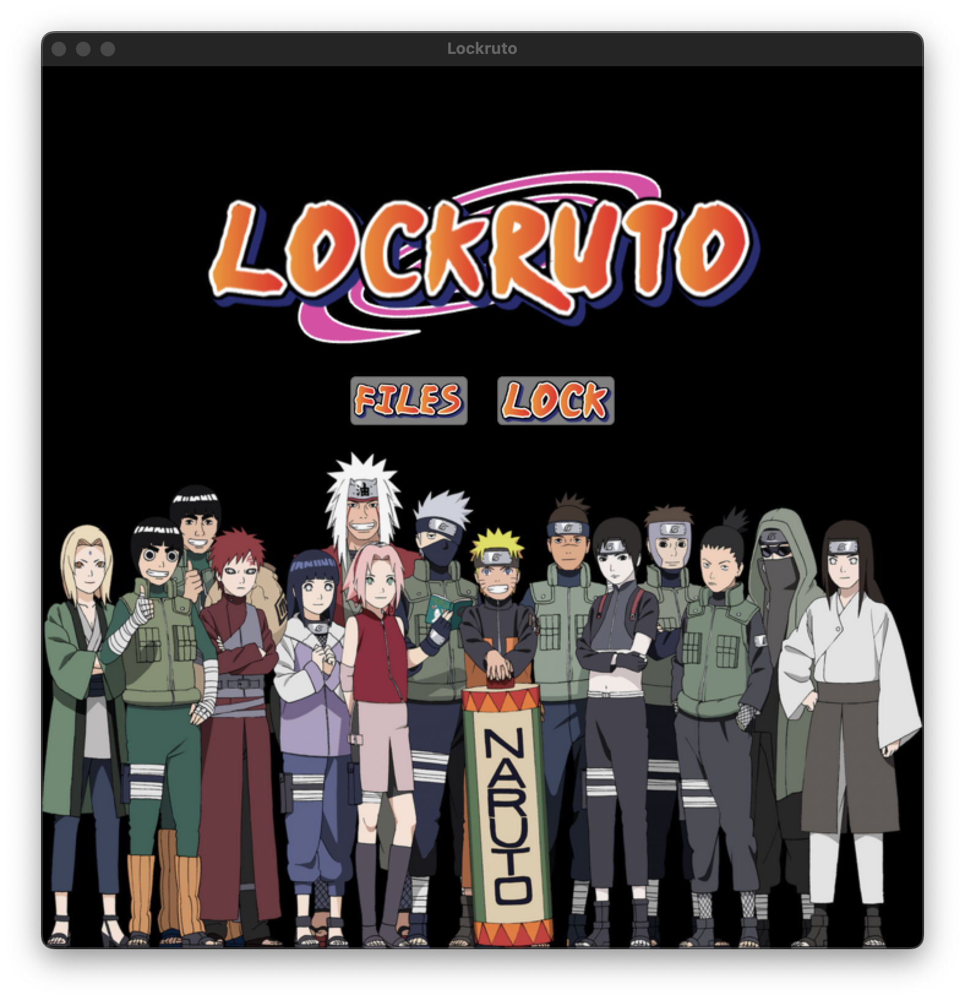

# 나루토 인술로 파일 암호화, 복호화 해버리기!

{: .align-center .img-width-half}
[프로젝트 시현 영상 바로가기](https://youtu.be/IU3buDiRD7g)
{: .text-center}

## 개발 동기

그냥 나루토를 좋아하는 평범한 방구석 닌자였었다.  
그러다 깃허브의 재밌는 레포지토리를 보게 되었는데...  
그것은 [카즈히토상의 나루토 Hand Sign Detection!](https://github.com/Kazuhito00/NARUTO-HandSignDetection/blob/main/README_EN.md)  
오픈소스를 보자마자 바로 작업에 들어가야겠다고 생각했다.  
그래서 이 모델로 무슨 짓을 해야 유용하면서도 재밌을까 생각해봤다.  
그래서 내린 결론이 패스워드의 인터페이스를 인술로 하면 재밌겠다고 판단했다.  
그 후 바로 소스를 까고 작업에 들어갔다.

## 개발에 사용한 것

- 카즈히토상의 인술 탐지 모델(onnx)
  - .onnx 파일을 핸들링하는 [클래스](https://github.com/Kazuhito00/NARUTO-HandSignDetection/blob/main/model/yolox/yolox_onnx.py)를 사용하였다.
- [Tkinter](https://docs.python.org/ko/3/library/tkinter.html)
  - 컴퓨터 응용프로그램을 목적으로 개발을 시작했다.  
    응용프로그램을 실제 상품의 목적이 아닌 내가 직접쓰는
    간단한 프로그램이 목적이였다.  
    그래서 파이썬의 내장 라이브러리인 Tkinter로 빠르게 개발을 할 수 있기에 선택하였다.
- 이미지 핸들링 라이브러리
  - [Pillow](https://pillow.readthedocs.io/)
    - Tkinter에 이미지, 캠을 삽입할때 사용했다.
  - [OpenCV](https://opencv-python.readthedocs.io/en/latest/)
    - 캠을 캡쳐한 사진을 가져올때, 모델의 input을 처리할때 사용했다.
- [PyCryptodome](https://pycryptodome.readthedocs.io/en/latest/src/installation.html)
  - 예전부터 사용되던 PyCrypto와 호환성을 각제 만든 것이 PyCryptodome이다.  
    파일을 암호화, 복호화할때 사용했다.

## 구현

화면구현을 담담하는 코드는 간단하게 계층구조와 메서드를 추상적으로 설명하겠다.  
모델 핸들링 코드와 파일 암호화, 복호화 부분은 조금 구체적으로 얘기해보도록 하겠다.  
오픈소스이므로 [내 깃허브 레포지토리](https://github.com/sonG1031/lockruto)를 통해 설명하지 못한 부분을 스스로 느껴보자.

### 프로젝트 구조

프로젝트 구조는 아래와 같다.
{: .text-center}
{: .align-center .img-width-half}

- images
  - 화면구현에 사용한 버튼, 배경화면 등을 담고있다.
- model
  - 카즈히토상의 오픈소스에서 그대로 가져온 폴더이다.  
    .onnx 파일과 그 파일을 inference할 수 있는 클래스 파일이 있다.
- screens
  - tkinter를 통한 화면을 구성하는 코드를 담고있다.
- settings
  - model에서 나온 결과와 비교하여 문자열 값을 얻기 위해 .csv 파일로 각 인술명이 적혀있다.
- tests
  - 그냥 개발과정에서 테스트할 코드를 적은 폴더이다.
- utils
  - 소리를 재생(버튼 클릭시, 암호화 시)시켜주는 기능을 담고있다.
- main.py
  - 프로그램을 실행했을때 시작점이다.

### 화면구현 부분

- screens/basic_screen.py

```python
from tkinter import *

class Screen:
    def __init__(self, root):

        self.colors = {
            "background": "#000000",
            "button": "#332F2E",
            "box": "#1F1C1C",
            "activeBtn": "#D941A4"
        }

        self.frames = {
            "start_screen": Frame(root, relief="solid", bg=self.colors["background"]),
            "files_screen": Frame(root, relief="solid", bg=self.colors["background"]),
            "lock_screen": Frame(root, relief="solid", bg=self.colors["background"]),
            "jutsu_screen": Frame(root, relief="solid", bg=self.colors["background"]),
            "open_screen": Frame(root, relief="solid", bg=self.colors["background"]),
            "unlock_screen": Frame(root, relief="solid", bg=self.colors["background"]),
        }

        self.root = root
        self.root.title("Lockruto")
        self.root.resizable(False, False)
        self.root.geometry("720x720")
        self.root.config(bg=self.colors['background'])

    def show_screen(self):
        from screens.frames import StartFrame

        st_screen = StartFrame(self.root, self.frames, "start_screen", self.colors)
        st_screen.create_frame()

        self.root.mainloop()
```

화면 코드 구조는 전역으로 관리되는 화면을 그린 다음,  
각 메뉴에 맞게 화면을 프레임으로 구성하여 화면을 나누었다.  
이 클래스의 인스턴스를 main.py에서 생성하여 show_screen() 메서드를 호출하면  
모든 화면들의 사이클이 시작된다.  
show_screen()에서는 시작 화면 프레임을 화면에 그린다.

- screens/basic_frames.py

```python
from tkinter import *
from tkinter import Listbox

from PIL import Image, ImageTk
from tkmacosx import Button

from utils import playSound
class ScreenFrame:
    def __init__(self, root, frames, frame_name, colors):
        self.root = root
        self.frame = frames
        self.frame_name = frame_name
        self.colors = colors
        self.list_file = None

    def create_frame(self):
        pass

    def pack_frame(self, frame_pady): # frame_pady: tuple(top: int, bottom: int)
        self.frame[self.frame_name].pack(pady=frame_pady)

    def create_title(self, title_path, title_size): # titleSize: tuple(int, int)
        title_img = Image.open(title_path)
        title_img = title_img.resize(title_size, Image.ANTIALIAS)
        title_photo = ImageTk.PhotoImage(title_img)
        title = Label(self.frame[self.frame_name], image=title_photo, bg=self.colors["background"], )
        title.image = title_photo
        title.pack(side="top")

    def create_list(self):
        list_frame = Frame(
            self.frame[self.frame_name],
            padx=100,
            pady=20,
            bg=self.colors["background"],
        )
        list_frame.pack(side="top", fill="both")

        scrollbar = Scrollbar(list_frame)
        scrollbar.pack(side="right", fill="y")

        self.list_file = Listbox(
            list_frame,
            selectmode="extended",
            height=15,
            width=200,
            bg=self.colors["box"],
            yscrollcommand=scrollbar.set)
        self.list_file.pack(side="left", fill="both", expand=True)
        scrollbar.config(command=self.list_file.yview)

        self.list_file.focus_set()

    def create_btns(self, btns_info):
        btns_frame = Frame(
            self.frame[self.frame_name],
            bg=self.colors["background"],
        )
        btns_frame.pack(pady=(0,20))

        for btn_info in btns_info:
            self.create_btn(btns_frame, **btn_info)


    def create_btn(
            self,
            btns_frame,
            btn_path,
            btn_size, # btn_size: tuple(int, int)
            btn_w,
            btn_h,
            btn_cmd,
            btn_side):
        btn_img = Image.open(btn_path)
        btn_img = btn_img.resize(btn_size, Image.ANTIALIAS)
        btn_photo = ImageTk.PhotoImage(btn_img)

        btn = Button(
            btns_frame,
            image=btn_photo,
            width=btn_w,
            height=btn_h,
            fg=self.colors["button"],
            activebackground=self.colors["activeBtn"],
            bg=self.colors["background"],
            borderless=1,
            command=btn_cmd
        )
        btn.image = btn_photo
        btn.pack(side=btn_side, padx=10)

    def create_bg(self, bg_path):
        bg_photo = PhotoImage(file=bg_path)
        bg = Label(self.frame[self.frame_name], image=bg_photo, bg=self.colors["background"],)
        bg.image = bg_photo
        bg.pack(side="bottom")


    def move_window(self, move_frame_name, lst_files=None):
        from screens.frames import StartFrame, FilesFrame, LockFrame, JutsuFrame, OpenFrame, UnlockFrame
        playSound("./utils/sounds/HEUA.mp3")

        self.frame[self.frame_name].destroy()
        self.frame[self.frame_name] = Frame(self.root, relief="solid", bg=self.colors["background"])
        print(f"{self.frame_name} destroyed")

        if move_frame_name == "start_screen":
            StartFrame(self.root, self.frame, "start_screen", self.colors).create_frame()
        elif move_frame_name == "files_screen":
            FilesFrame(self.root, self.frame, "files_screen", self.colors).create_frame()
        elif move_frame_name == "lock_screen":
            LockFrame(self.root, self.frame, "lock_screen", self.colors, lst_files).create_frame()
        elif move_frame_name == "jutsu_screen":
            JutsuFrame(self.root, self.frame, "jutsu_screen", self.colors, lst_files).create_frame()
        elif move_frame_name == "open_screen":
            OpenFrame(self.root, self.frame, "open_screen", self.colors, lst_files).create_frame()
        elif move_frame_name == "unlock_screen":
            UnlockFrame(self.root, self.frame, "unlock_screen", self.colors, lst_files).create_frame()
```

메뉴에 맞는 프레임을 만들때 사용되는 프레임의 부모 클래스이다.  
각 화면 프레임의 공통되는 부분을 메서드로 호출하도록 구현했다.  
상속받은 클래스는 create_frame()을 상속받은 메서드를 사용해 구현하여  
메뉴에 맞게 화면을 그린다.

간단한 예로 모든 프레임말고 시작 화면 프레임 코드를 보여주겠다.

- screens/frames/start_frame.py

```python
from screens import ScreenFrame

class StartFrame(ScreenFrame):
    def create_frame(self):
        self.pack_frame((60,0))

        self.create_title("./images/start_screen_title.png", (500,187))

        btns_info = [
            {
                "btn_path": "./images/files_btn.png",
                "btn_size": (100,38),
                "btn_w": 100,
                "btn_h": 43,
                "btn_cmd":lambda:  self.move_window("files_screen"),
                "btn_side":"left"
            },
            {
                "btn_path": "./images/lock_btn.png",
                "btn_size": (100, 43),
                "btn_w": 100,
                "btn_h": 43,
                "btn_cmd":lambda:  self.move_window("lock_screen"),
                "btn_side": "left"
            },
        ]

        self.create_btns(btns_info)

        self.create_bg("./images/bg.png")

        print("start_frame created")
```

### 객체 인식 부분

앞서 말했듯이 객체 인식 기능은 카즈히토상의 모델을 가져왔다.  
그 모델은 onnx로 변환되어 있다. 변환되기 전은 카즈히토상의 레포지토리를 확인해보면  
\_legacy/v2/model 경로 밑에 3가지 종류의 모델들(Tensorflow models ZOO)이 있는 것을 확인할 수 있다.

- EfficientDetDO

  - EfficientNet 모델로 예측되는데, EfficientNet이란?  
    이미지 분류 작업이 기존(합성곱 신경망)보다 훨씬 적은 파라미터수로 더욱 좋은 성능을 내서  
    SOTA를 달성한 모델이다. SOTA는 어떤 분야에서 현재까지 가장 최고 수준의 성능, 기술, 혁신을 나타내는 것.  
    그러나 2020년 기준에서의 얘기이므로 최근에 발표된 다른 모델들을 확인해보자.
  - 그렇다면 더욱 좋은 성능을 낼 수 있었던 이유는?  
    기존 연구들은 합성곱 신경망의 성능을 올리기 위해 scaling up 시도를 많이 했다고 한다.  
    예를 들어 레이어의 개수(망의 깊이)를 늘려 성능을 향상 시키는 것 말이다.  
    Scale-up 방법은 3가지가 있다.

    1. 망의 depth를 늘리는 것(=망의 개수 늘린다는 말): 가장 흔한 방법
    2. channel width를 늘리는 것(=filter의 개수를 늘림): 연구에 따르면 width를 넓게 할 수록 미세한 정보들이 더 많이 담긴다고 함
    3. 입력 이미지의 해상도를 높인다: 실험을 통해 더 큰 사이즈의 이미지를 넣으면 성능이 올라감을 확인했다고 함

    EfficientNet은 위 세가지 방법에 대한 최적의 조합을 AUtoML을 통해 찾은 모델이다.

- MobileNet
  - 모바일 기기에서 동작하는 것을 목표로한 CNN 아키텍쳐.  
    아래의 두 버전이 카즈히토상이 사용했던 모델들이다.
    - MobileNetv2_SSD_300x300
    - MobileNetv2_SSD_FPNLite_640×640

모델은 여기까지만 설명하겠다.  
더 자세한 설명은 참고한 자료인 [[논문 리뷰] EfficientNet 정리 (MobileNet 부터 EfficientNet 까지)](https://lynnshin.tistory.com/53) 를 읽어보자!

그렇다면 계속 언급되어왔던 onnx에 대해 알아보자.

- ONNX 란?
  - ONNX(Open Neural Network Exchange)는 서로 다른 인공 지능 및 기계 학습 모델을 Tensorflow, PyTorch와 같은 다양한 프레임워크 간에 공유하고 실행할 수 있도록 설계된 오픈 표준 형식.
  - ONNX는 모델의 구조와 가중치를 포함한 모델을 중립적인 형식으로 변환하여 서로 다른 DNN 프레임워크 사이에서 모델을 이식하고 실행하는 것을 용이하게 해준다.
  - ONNX는 다른 DNN 프레임워크 보다 추론 속도가 빠르고 성능도 거의 똑같이 유지된다.

그렇다면 이제 왜 카즈히토상이 MobileNet을 사용했고, ONNX로 변환했는지 알 수 있다.  
GPU가 없는 환경(나의 맥북같이)에서 빠른, 혹은 이상적인 성능을 내기위한 것이다!  
그렇다면 그렇게 추출한 onnx 파일을 사용할 수 있게 해주는 model/yolox/yolox_onnx.py를 뜯어보자!

- model/yolox/yolox_onnx.py

```python
import copy

import cv2
import numpy as np
import onnxruntime # onnx 파일을 사용하기 위해


class YoloxONNX(object):
    def __init__(
        self,
        model_path='yolox_nano.onnx', # 변환된 onnx 파일
        input_shape=(416, 416), # 학습된 모델에 넣어야할 이미지 크기
        class_score_th=0.3, # 추론한 클래스의 정확도 임계값
        nms_th=0.45,
        nms_score_th=0.1,
        with_p6=False,
        providers=('CUDAExecutionProvider', 'CPUExecutionProvider'),
    ):
        # 입력 사진 크기
        self.input_shape = input_shape

        # threshold(역치)
        self.class_score_th = class_score_th
        self.nms_th = nms_th
        self.nms_score_th = nms_score_th

        self.with_p6 = with_p6

        # 모델 불러오기
        self.onnx_session = onnxruntime.InferenceSession(
            model_path,
            providers=providers,
        )

        self.input_name = self.onnx_session.get_inputs()[0].name
        self.output_name = self.onnx_session.get_outputs()[0].name

    def inference(self, image):
        temp_image = copy.deepcopy(image)
        image_height, image_width = image.shape[0], image.shape[1]

        # 사진 전처리, input_shape에 맞게 사진 크기를 조정, 패딩 추가
        preprocess_image, ratio = self._preprocess(temp_image, self.input_shape)

        # 예측, prediction!
        results = self.onnx_session.run(
            None,
            {self.input_name: preprocess_image[None, :, :, :]},
        )

        # 사진 후처리
        bboxes, scores, class_ids = self._postprocess(
            results[0],
            self.input_shape,
            ratio,
            self.nms_th,
            self.nms_score_th,
            image_width,
            image_height,
            p6=self.with_p6,
        )

        return bboxes, scores, class_ids

    def _preprocess(self, image, input_size, swap=(2, 0, 1)): # axis 0, 1, 2
        if len(image.shape) == 3:
            padded_image = np.ones(
                (input_size[0], input_size[1], 3), dtype=np.uint8) * 114
        else:
            padded_image = np.ones(input_size, dtype=np.uint8) * 114

        ratio = min(input_size[0] / image.shape[0],
                    input_size[1] / image.shape[1])
        resized_image = cv2.resize(
            image,
            (int(image.shape[1] * ratio), int(image.shape[0] * ratio)),
            interpolation=cv2.INTER_LINEAR,
        )
        resized_image = resized_image.astype(np.uint8)

        padded_image[:int(image.shape[0] * ratio), :int(image.shape[1] *
                                                        ratio)] = resized_image
        padded_image = padded_image.transpose(swap) # 축의 차원을 바꿈
        padded_image = np.ascontiguousarray(padded_image, dtype=np.float32) # 넘파이 연속배열로 변환
        # 메모리에 연속적으로 저장되지 않는 배열을 연속적으로 저장되는 배열로 변환하기 때문에 더 빠르게 데이터를 불러올 수 있음
        return padded_image, ratio

    def _postprocess(
        self,
        outputs,
        img_size,
        ratio,
        nms_th,
        nms_score_th,
        max_width,
        max_height,
        p6=False,
    ):
        grids = []
        expanded_strides = []

        if not p6:
            strides = [8, 16, 32]
        else:
            strides = [8, 16, 32, 64]

        hsizes = [img_size[0] // stride for stride in strides]
        wsizes = [img_size[1] // stride for stride in strides]

        for hsize, wsize, stride in zip(hsizes, wsizes, strides):
            xv, yv = np.meshgrid(np.arange(wsize), np.arange(hsize))
            grid = np.stack((xv, yv), 2).reshape(1, -1, 2)
            grids.append(grid)
            shape = grid.shape[:2]
            expanded_strides.append(np.full((*shape, 1), stride))

        grids = np.concatenate(grids, 1)
        expanded_strides = np.concatenate(expanded_strides, 1)
        outputs[..., :2] = (outputs[..., :2] + grids) * expanded_strides
        outputs[..., 2:4] = np.exp(outputs[..., 2:4]) * expanded_strides

        predictions = outputs[0]
        boxes = predictions[:, :4]
        scores = predictions[:, 4:5] * predictions[:, 5:]

        boxes_xyxy = np.ones_like(boxes)
        boxes_xyxy[:, 0] = boxes[:, 0] - boxes[:, 2] / 2.
        boxes_xyxy[:, 1] = boxes[:, 1] - boxes[:, 3] / 2.
        boxes_xyxy[:, 2] = boxes[:, 0] + boxes[:, 2] / 2.
        boxes_xyxy[:, 3] = boxes[:, 1] + boxes[:, 3] / 2.
        boxes_xyxy /= ratio

        dets = self._multiclass_nms(
            boxes_xyxy,
            scores,
            nms_thr=nms_th,
            score_thr=nms_score_th,
        )

        bboxes, scores, class_ids = [], [], []
        if dets is not None:
            bboxes, scores, class_ids = dets[:, :4], dets[:, 4], dets[:, 5]
            for bbox in bboxes:
                bbox[0] = max(0, bbox[0])
                bbox[1] = max(0, bbox[1])
                bbox[2] = min(bbox[2], max_width)
                bbox[3] = min(bbox[3], max_height)

        return bboxes, scores, class_ids

    def _nms(self, boxes, scores, nms_thr):
        x1 = boxes[:, 0]
        y1 = boxes[:, 1]
        x2 = boxes[:, 2]
        y2 = boxes[:, 3]

        areas = (x2 - x1 + 1) * (y2 - y1 + 1)
        order = scores.argsort()[::-1]

        keep = []
        while order.size > 0:
            i = order[0]
            keep.append(i)
            xx1 = np.maximum(x1[i], x1[order[1:]])
            yy1 = np.maximum(y1[i], y1[order[1:]])
            xx2 = np.minimum(x2[i], x2[order[1:]])
            yy2 = np.minimum(y2[i], y2[order[1:]])

            w = np.maximum(0.0, xx2 - xx1 + 1)
            h = np.maximum(0.0, yy2 - yy1 + 1)
            inter = w * h
            ovr = inter / (areas[i] + areas[order[1:]] - inter)

            inds = np.where(ovr <= nms_thr)[0]
            order = order[inds + 1]

        return keep

    def _multiclass_nms(
        self,
        boxes,
        scores,
        nms_thr,
        score_thr,
        class_agnostic=True,
    ):
        if class_agnostic:
            nms_method = self._multiclass_nms_class_agnostic
        else:
            nms_method = self._multiclass_nms_class_aware

        return nms_method(boxes, scores, nms_thr, score_thr)

    def _multiclass_nms_class_aware(self, boxes, scores, nms_thr, score_thr):
        final_dets = []
        num_classes = scores.shape[1]

        for cls_ind in range(num_classes):
            cls_scores = scores[:, cls_ind]
            valid_score_mask = cls_scores > score_thr

            if valid_score_mask.sum() == 0:
                continue
            else:
                valid_scores = cls_scores[valid_score_mask]
                valid_boxes = boxes[valid_score_mask]
                keep = self._nms(valid_boxes, valid_scores, nms_thr)
                if len(keep) > 0:
                    cls_inds = np.ones((len(keep), 1)) * cls_ind
                    dets = np.concatenate(
                        [
                            valid_boxes[keep], valid_scores[keep, None],
                            cls_inds
                        ],
                        1,
                    )
                    final_dets.append(dets)

        if len(final_dets) == 0:
            return None

        return np.concatenate(final_dets, 0)

    def _multiclass_nms_class_agnostic(self, boxes, scores, nms_thr,
                                       score_thr):
        cls_inds = scores.argmax(1)
        cls_scores = scores[np.arange(len(cls_inds)), cls_inds]

        valid_score_mask = cls_scores > score_thr

        if valid_score_mask.sum() == 0:
            return None

        valid_scores = cls_scores[valid_score_mask]
        valid_boxes = boxes[valid_score_mask]
        valid_cls_inds = cls_inds[valid_score_mask]
        keep = self._nms(valid_boxes, valid_scores, nms_thr)

        dets = None
        if keep:
            dets = np.concatenate([
                valid_boxes[keep],
                valid_scores[keep, None],
                valid_cls_inds[keep, None],
            ], 1)

        return dets

```

주석으로 열심히 설명하다가 \_postprocess 메서드에서부터 설명이 없는 것을 볼 수 있다.  
그 이유는 \_postprocess부터 그 아래까지의 코드가 yolox에서 결과값(바운딩 박스)을 추출하는 방법을 코드로 작성한 것으로 보이기 때문이다.  
여기서 깨달았다. 왜 MobileNet을 썼으면서 yolox라고 이름을 붙였는지... 내가 무식했다.  
이 코드를 같이 이해하기 위해 [YOLOX 논문 리뷰](https://cobslab.tistory.com/13)를 읽어봅시더

그럼 이제 tkinter와 어떻게 같이 사용되는지 알아보자  
아래의 코드는 screens/frames/jutsu_frame.py의 JutsuFrame.create_frame 메서드의 속의 코드 일부분이다.

- screens/frames/jutsu_frame.py
- JutsuFrame.create_frame

```python

         # 빈 컨테이너 느낌, 캠 사진을 빠르게 한장 한장 이 컨테이너에 업데이트하면 영상처럼 보임!
        cam_label = Label(self.frame[self.frame_name], bg=self.colors['background'])
        cam_label.pack()

        ############################################ 기초 변수 설정
        model_path = "model/yolox/yolox_nano.onnx"
        input_shape = (416, 416)
        score_th = 0.75
        nms_th = 0.45
        nms_score_th = 0.1
        with_p6 = False

        frame_count = 0
        fps = 60
        skip_frame = 0
        play_effect_count = 0

        ############################################ .onnx 모델 가져오기
        yolox = YoloxONNX(
            model_path=model_path,
            input_shape=input_shape,
            class_score_th=score_th,
            nms_th=nms_th,
            nms_score_th=nms_score_th,
            with_p6=with_p6,
            providers=['CPUExecutionProvider'],
        )

        ############################################ 바운딩 박스와 같이 띄어줄 텍스트
        with open('setting/labels.csv', encoding='utf8') as f:
            labels = csv.reader(f)
            labels = [row for row in labels]

        while self.cap.isOpened():
            start_time = time.time()
            ret, img = self.cap.read()

            if not ret:  # 캡처가 안됬을때
                continue

            debug_img = copy.deepcopy(img)

            frame_count += 1
            if (frame_count % (skip_frame + 1)) != 0:  # 스킵할 프레임 범위에 있다면
                continue

            ############################################ 모델에 웹캡으로 입력받은 사진 -> 예측값 받아오기
            if not self.is_pw_done:
                bboxes, scores, class_ids = yolox.inference(img)

                ############################################ 반복문을 통해 가장 높은 점수의 클래스 찾기
                for bbox, score, class_id in zip(bboxes, scores, class_ids):
                    class_id = int(class_id) + 1
                    if score < score_th:  # score_th(threshold)보다 높지 않으면 넘김
                        continue

                    ############################################ 바운딩 박스 좌표
                    x1, y1 = int(bbox[0]), int(bbox[1])
                    x2, y2 = int(bbox[2]), int(bbox[3])

                    cv2.putText(
                        debug_img, 'ID:' + str(class_id) + ' ' +
                                     labels[class_id][0] + ' ' + '{:.3f}'.format(score),
                        (x1, y1 - 15), cv2.FONT_HERSHEY_SIMPLEX, 0.6, (255, 255, 0), 2,
                        cv2.LINE_AA)  # 예측한 클래스를 바운딩 박스 위에 그리기
                    cv2.rectangle(debug_img, (x1, y1), (x2, y2), (255, 255, 0), 2)  # 바운딩 박스

                    # 각 인술 당 한번의 소리를 내기 위해서
                    if play_effect_count == 0:
                        playSound("./utils/sounds/jutsu.mp3")
                        play_effect_count += 1
                        self.tmp_class_id = class_id
                        if self.pw_idx < len(self.pw_lst): # 패스워드 입력 상태 업데이트
                            self.pw_lst[self.pw_idx]['image'] = self.mangekyo_photo
                            self.pw_idx += 1
                        if self.pw_idx == len(self.pw_lst):
                            self.is_pw_done = True

                        self.pw.append(labels[class_id][0])

                    elif self.tmp_class_id != class_id: # 새로운 인술을 했을때
                        play_effect_count = 0

            ############################################ FPS 계산
            elapsed_time = time.time() - start_time  # 경과 시간
            sleep_time = max(0, int((1.0 / fps) - elapsed_time))  # 프레임 조정을 위해
            time.sleep(sleep_time)

            cv2.putText(
                debug_img,
                "FPS:" + '{:.1f}'.format(elapsed_time * 1000) + "ms",
                (10, 30), cv2.FONT_HERSHEY_SIMPLEX, 0.8, (0, 255, 0), 2, cv2.LINE_AA)

            debug_img = cv2.resize(debug_img, dsize=(320,180), interpolation=cv2.INTER_LINEAR)
            debug_img = cv2.cvtColor(debug_img, cv2.COLOR_BGR2RGB)
            debug_img = ImageTk.PhotoImage(Image.fromarray(debug_img))
            cam_label['image'] = debug_img # tkinter 화면에 삽입됨

            self.root.update() # 매반복 새로고침
        self.cap.release()
        cv2.destroyAllWindows()
```

### 암호화 부분

이제 마지막으로 파일을 암호화하는 과정을 살펴보자  
나루토 인술을 키로 사용하는 암호화이므로 대칭키 알고리즘 중 가장 유명한 AES 알고리즘을 사용했다.

- AES 란?
  - 고급 암호화 표준
  - AES(Advanced Encryption Standard)는 DES의 암호화 강도가 약해지면서 개발되었으며  
    향후 30년 정도 사용할 수 있는 안정성, 128비트 암호화 블록, 다양한 키의 길이(128/192/256 비트)를 갖춘 대칭형 암호 알고리즘이다.

그럼 바로 코드로 넘어가보자잉

- screens/frames/jutsu_frame.py
- JutsuFrame.encrypt_cmd

```python
    def encrypt_cmd(self):
        if len(self.pw) < 6: # 인술을 다 끝내지 않았을때
            playSound("./utils/sounds/HEUA.mp3")
            msgbox.showwarning("WAIT!", "You have to finish your Jutsu!!")
            return
        print(self.pw)

        BS = 16 # padding, 블록 사이즈
        # 필요한 이유는 암호문이 블록의 배수가 되기 때문에 복호화 후 원본을 얻기 위해서 Padding을 해야한다.
        PW = "".join(self.pw)
        # salt 값은 하드코딩했지만, 절대 하드코딩해성는 안되는 값이다.
        PW = PBKDF2(PW, self.salt, dkLen=32) # 반복 대입, 복붙 공격 등의 취약점 방지

        home_path = os.path.expanduser('~')

        try:
            for lst_file in self.lst_files:
                    file_name = lst_file.split('/')[-1]
                    file_path = f"{home_path}/.Lockruto/{file_name}.lockruto"
                    with open(lst_file, 'rb') as f:
                        cipher = AES.new(PW, AES.MODE_CBC) # AES.MODE_CBC는 블록암호 운용 방식이다.
                        cipher_file = cipher.encrypt(pad(f.read(), BS)) # 원본을 패딩 후 암호화
                    with open(lst_file, 'wb') as f:
                        f.write(cipher.iv)
                        f.write(cipher_file)
                    os.rename(lst_file, file_path) # 암호화 후 락루토 폴더로 이동
                    # os.chmod(file_path, 0000)
        except Exception as e:
            msgbox.showerror("Error", str(e))
            return

        # 암호화 성공 후
        playSound("./utils/sounds/jutsuFinished.mp3")
        msgbox.showinfo("Encrypted", f"{len(self.lst_files)} files are encrypted")

        self.home_cmd()
```

주석을 보고도 주석의 단어가 뭔지 모르는 것들이 좀 있을 것이다.  
우선 블록 사이즈를 설정한 부분을 간단하게 설명하자면 우선 AES는 블록 암호화 방식이다.  
블록암호(Block Cipher)란 기밀성있는 정보를 고정된 크기의 블록 단위로 나누어 암호화 작업을 하는 대칭키 암호 시스템이다.
그럼 이제 블록 사이즈 주석은 어느정도 이해가 된다고 생각한다.  
블록암호 운용 방식은 원본을 블록 단위로 나눴을때, 그 블록들의 암호화 방식이다.
CBC 방식이 현재 널리 사용된다고 하여 사용하게 되었다.
깊게 들어가지 않으면 그렇게 어렵지 않아 대충 설명해버렸지만 내가 보고 이해한 자료인
[블록암호와 운용방식](https://blog.naver.com/jsky10503/221258926405)을 읽었기 때문에 쉬운 이해가 가능했다고 생각한다.  
CBC의 암호화 원리에 대해 알아보고 싶다면 꼭! 읽어보자

## 마무리

설명이 너무 길었다. 근데 좀 나불대고 싶었다..  
다음부터는 자제하겠다. 소감은 인공지능에 대해 더 깊이 배워보는 것에만 혈안이였는데  
이렇게 만들어진 모델을 활용하는게 현재로서는 모델을 이해하는데 더 도움이 되는 것 같다.  
그리고 암호화에 대해서도 잡지식을 얻어 좋은 경험이였다.

## [락루토 깃허브 레포지토리](https://github.com/sonG1031/lockruto)

이 오픈소스가 재밌는 개발에 도움이 되기를🙏
